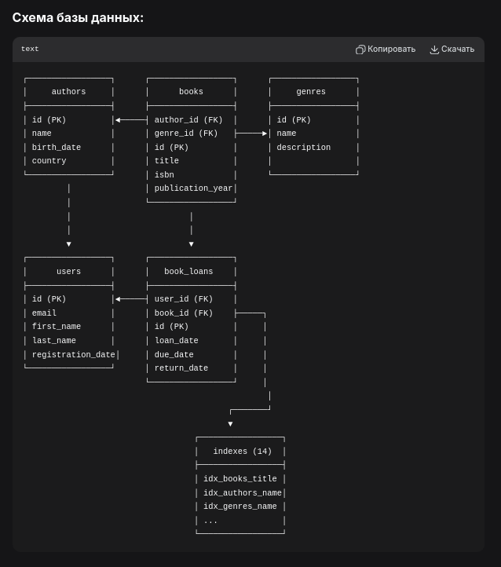
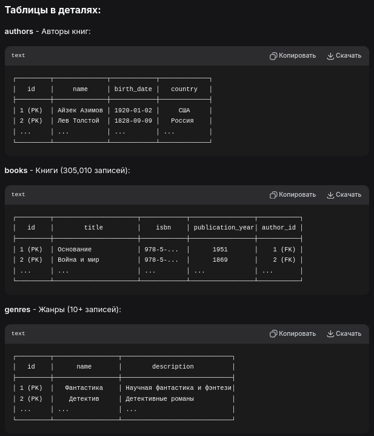
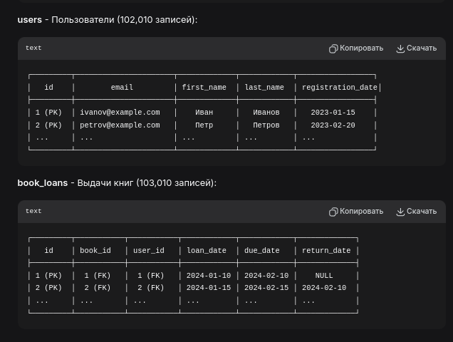

### Серверное программирование
**Программная инженерия СФУ**

Лабараторные работы по Серверному программированию

Как я понял, на протяжении всех лаб проект сохраняется, так что делить по папкам лабораторные не буду


### БД








### Структура классов

```
📁 src/main/kotlin/edu/sfu/
│
├── 📁 entity/           # Сущности JPA/Hibernate
│   ├── Author.kt       📍 Автор (связь 1:N с Book)
│   ├── Book.kt         📍 Книга (связи N:1 с Author/Genre, 1:N с BookLoan)
│   ├── Genre.kt        📍 Жанр (связь 1:N с Book)
│   ├── User.kt         📍 Пользователь (связь 1:N с BookLoan)
│   └── BookLoan.kt     📍 Выдача книги (связи N:1 с Book/User)
│
├── 📁 repository/       # Spring Data JPA репозитории
│   ├── AuthorRepository.kt     🔍 CRUD + кастомные запросы
│   ├── BookRepository.kt       🔍 CRUD + поиск книг
│   ├── GenreRepository.kt      🔍 CRUD + поиск жанров
│   ├── UserRepository.kt       🔍 CRUD + поиск пользователей
│   └── BookLoanRepository.kt   🔍 CRUD + поиск выдач
│
├── 📁 dto/              # Data Transfer Objects
│   ├── AuthorDTO.kt           📦 DTO для авторов
│   ├── BookDTO.kt            📦 DTO для книг
│   ├── BookWithDetailsDTO.kt 📦 Кастомная модель (данные из нескольких таблиц)
│   └── ...
│
├── 📁 service/          # Бизнес-логика
│   ├── AuthorService.kt           ⚙️ Сервис авторов
│   ├── BookWithDetailsService.kt  ⚙️ Сервис кастомных моделей
│   └── ...
│
├── 📁 controller/       # REST контроллеры
│   ├── AuthorController.kt        🌐 REST API для авторов
│   ├── BookController.kt          🌐 REST API для книг
│   ├── BookDetailsController.kt   🌐 REST API для кастомных моделей
│   └── TestController.kt          🌐 Тестовые эндпоинты
│
├── 📁 manager/         # DAO слой (из предыдущих лаб)
│   └── DAO.kt                    🗃️ Управление сессиями Hibernate
│
├── 📁 dao/             # DAO слой с Criteria API (ПЗ №5)
│   ├── BaseDAO.kt               🗃️ Базовый DAO с CRUD
│   ├── AuthorDAO.kt             🗃️ DAO для авторов + Criteria API
│   ├── BookDAO.kt               🗃️ DAO для книг + Criteria API
│   ├── GenreDAO.kt              🗃️ DAO для жанров
│   └── UserDAO.kt               🗃️ DAO для пользователей
│
├── 📁 services/        # Сервисы из ПЗ №4 (старые)
│   └── TestSrvs.kt              ⚙️ Базовые Hibernate операции
│
├── LibraryApplication.kt        🚀 Точка входа Spring Boot
├── Lab4Demo.kt                  📋 Демо ПЗ №4 (Hibernate)
├── Lab5Demo.kt                  📋 Демо ПЗ №5 (Criteria API)
└── Lab5Summary.kt               📊 Итоги ПЗ №5
```

```
           ┌─────────────────────────────────────────┐
           │         LibraryApplication.kt           │
           │  (Spring Boot главный класс)           │
           └──────────────────┬──────────────────────┘
                              │
           ┌──────────────────┼──────────────────────┐
           ▼                  ▼                      ▼
┌─────────────────┐  ┌─────────────────┐  ┌─────────────────┐
│  Контроллеры    │  │    Сервисы      │  │  Репозитории    │
│  (REST API)     │  │ (Бизнес-логика) │  │ (Spring Data JPA)│
├─────────────────┤  ├─────────────────┤  ├─────────────────┤
│ • AuthorController│ │ • AuthorService │ │ • AuthorRepository│
│ • BookController  │ │ • BookService   │ │ • BookRepository  │
│ • TestController  │ └─────────────────┘ │ • GenreRepository │
└─────────┬───────┘           │           └─────────┬───────┘
          │                   │                     │
          └───────────────────┼─────────────────────┘
                              │
                              ▼
                   ┌─────────────────────┐
                   │    Entity классы    │
                   │  (JPA/Hibernate)    │
                   ├─────────────────────┤
                   │ • Author            │
                   │ • Book              │
                   │ • Genre             │
                   │ • User              │
                   │ • BookLoan          │
                   └─────────────────────┘
```


### Start


**0й этап**
```bash
# 1. Установи PostgreSQL, Maven, Java 11+
sudo pacman -S postgresql maven jdk11-openjdk

# 2. Настрой PostgreSQL
sudo systemctl start postgresql
sudo systemctl enable postgresql

# 3. Клонируй/открой проект
cd /home/luckhost/programming/server_programming_sfu_3rd_course/
```


**ПЗ №1-2: Создание и наполнение БД**
```bash
# 1. Перейди в директорию с SQL скриптами
cd database/

# 2. Запусти скрипт настройки БД
chmod +x *.sh
./setup_robust.sh

# 3. Проверь, что БД создана
psql -h localhost -U lab_user -d lab_db -c "SELECT COUNT(*) FROM books;"

# Результат: БД с 500,000+ записей создана
```


**ПЗ №3: Нагрузочное тестирование и индексы**
```bash
# 1. Запусти скрипт ПЗ №3
cd database/
./run_lab3.sh

# 2. Проверь результаты
cat database/performance/results/execution_times.csv

# Результат: Тесты производительности выполнены, индексы созданы
```

**ПЗ №4: Hibernate и базовые операции**
```bash
# 1. Перейди в Java/Kotlin проект
cd ../library-kotlin/

# 2. Скомпилируй и запусти демо ПЗ №4
mvn compile exec:java -Dexec.mainClass="edu.sfu.Lab4DemoKt"

# Результат: Должны увидеть работу с БД через Hibernate
```

**ПЗ №5: Criteria API и DAO классы**
```bash
# 1. Запусти демо ПЗ №5
mvn compile exec:java -Dexec.mainClass="edu.sfu.Lab5DemoKt"

# 2. Посмотри итоги ПЗ №5
mvn compile exec:java -Dexec.mainClass="edu.sfu.Lab5SummaryKt"

# Результат: Демонстрация Criteria API и расширенных DAO
```

**ПЗ №6: Spring Boot REST API**
```bash
# 1. Запусти Spring Boot приложение
mvn clean spring-boot:run

# ИЛИ через IDEA: запусти LibraryApplication.kt

# 2. Открой веб-интерфейс в браузере
#    http://localhost:8080

# 3. Проверь REST API:
#    • http://localhost:8080/api/authors
#    • http://localhost:8080/api/books
#    • http://localhost:8080/api/book-details
#    • http://localhost:8080/api/test

# 4. Используй веб-интерфейс для:
#    • Просмотра авторов и книг
#    • Создания новых авторов
#    • Поиска просроченных книг
#    • Просмотра кастомных моделей

# Результат: Полнофункциональный REST API с веб-интерфейсом
```

**Быстрый старт (все одной командой):**
```bash
# На Arch Linux:
cd /home/luckhost/programming/server_programming_sfu_3rd_course/
./database/setup_robust.sh                # ПЗ №1-2
./database/run_lab3.sh                    # ПЗ №3
cd library-kotlin/
mvn compile exec:java -Dexec.mainClass="edu.sfu.Lab4DemoKt"  # ПЗ №4
mvn compile exec:java -Dexec.mainClass="edu.sfu.Lab5DemoKt"  # ПЗ №5
mvn clean spring-boot:run                                    # ПЗ №6
```

## 📊 СТАТИСТИКА ПРОЕКТА

### Объем данных:
- ✅ **Авторов:** 10,510 записей
- ✅ **Книг:** 305,010 записей  
- ✅ **Пользователей:** 102,010 записей
- ✅ **Выдач книг:** 103,010 записей
- ✅ **Жанров:** 10+ записей
- ✅ **Индексов:** 14 штук

### Технологии:
- **БД:** PostgreSQL 14+
- **Backend:** Kotlin + Spring Boot 2.7
- **ORM:** Hibernate 5.6 + Spring Data JPA
- **Сборка:** Maven
- **Фронтенд:** HTML/JavaScript (для демо)
- **Тестирование:** Нагрузочное тестирование, Criteria API

### Выполненные требования:
- ✅ **ПЗ №1:** Архитектура БД, 5+ таблиц, 10+ записей
- ✅ **ПЗ №2:** Связи между таблицами, 10,000+ записей
- ✅ **ПЗ №3:** Нагрузочное тестирование, индексы, 500,000+ записей
- ✅ **ПЗ №4:** Hibernate, Entity классы, базовые операции
- ✅ **ПЗ №5:** Criteria API, DAO классы, динамические запросы
- ✅ **ПЗ №6:** REST API, Spring Boot, кастомные модели, веб-интерфейс
